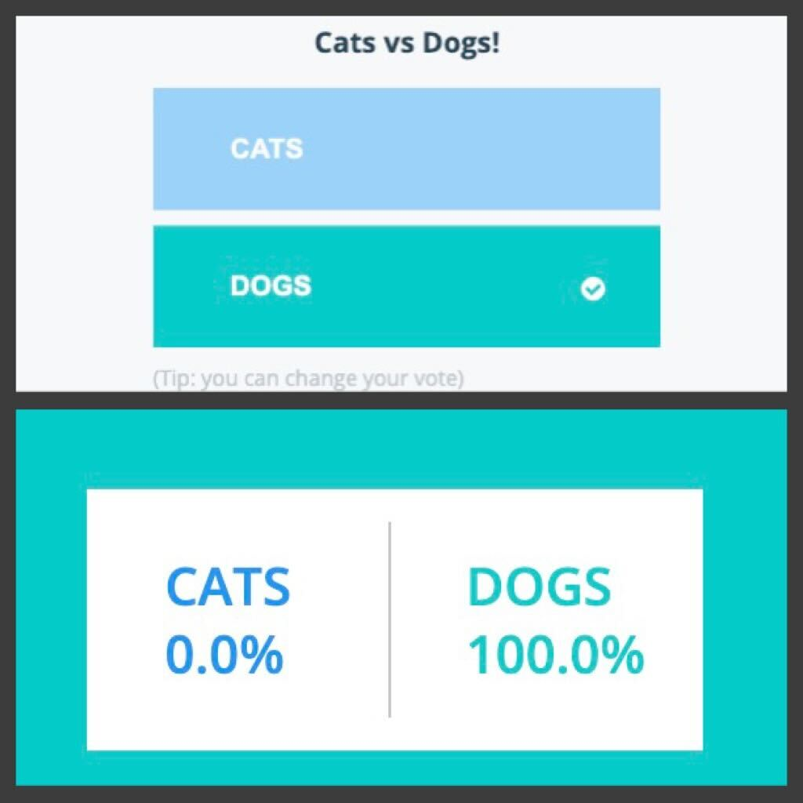

# AKS Voting Application Deployment

This repository demonstrates deploying a microservices-based voting application on **Azure Kubernetes Service (AKS)**. The architecture includes multiple services like Python, Redis, .NET, PostgreSQL, and Node.js.

## Prerequisites

- Azure Account
- Active Azure Subscription
- Basic Azure Knowledge
- Docker & Kubernetes CLI Tools Installed

## Deployment Steps

### Step 1: Set Up AKS Cluster
1. Log in to your Azure account.
2. Navigate to **Kubernetes Services**.
3. Create a new **Kubernetes cluster**:
   - **Name**: `example-voting-app`
   - **Node Size**: `Standard_D4s_v3` (as per policy)
4. Create a **Resource Group**:
   - **Name**: `votingapp-rg`

_**Note**: Allow some time for the cluster to be ready._

### Step 2: Configure kubectl
Run the following command to configure access to your AKS cluster:
```bash
az aks get-credentials --resource-group votingapp-rg --name example-voting-app
```

### Step 3: Clone This Repository
```bash
git clone https://github.com/osherachamim/AKS-voting-app-deployment.git
cd AKS-voting-app-deployment
```

### Step 4: Deploy Kubernetes Resources
Run the following command to deploy the resources:
```bash
kubectl create -f <filename>
```
Deployments include:
- Front-End (Python)
- Redis
- Worker (.NET)
- PostgreSQL
- Results App (Node.js)

### Step 5: Verify Deployment
Use the following command to ensure all pods, services, and deployments are running:
```bash
kubectl get pods,svc,deployments
```

### Architecture Overview
The application consists of:
1. **Voting App (Python)**: Front-end to cast votes.
2. **Redis**: Temporary data store for votes.
3. **Worker (.NET)**: Processes votes from Redis to PostgreSQL.
4. **PostgreSQL**: Stores votes persistently.
5. **Results App (Node.js)**: Displays real-time voting results.

### Accessing the Application
- **Voting App**: `http://<voting-service-EXTERNAL-IP>:<PORT>`
- **Results App**: `http://<result-service-EXTERNAL-IP>:<PORT>`



## Resources
For detailed steps, refer to the [Microsoft AKS Documentation](https://learn.microsoft.com/en-us/azure/aks/learn/quick-kubernetes-deploy-portal?tabs=azure-cli).

## Conclusion

This voting app demonstrates how to build a microservices-based application using multiple technologies such as Python, Redis, .NET, PostgreSQL, and Node.js. 
